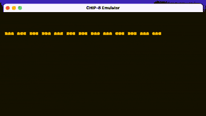
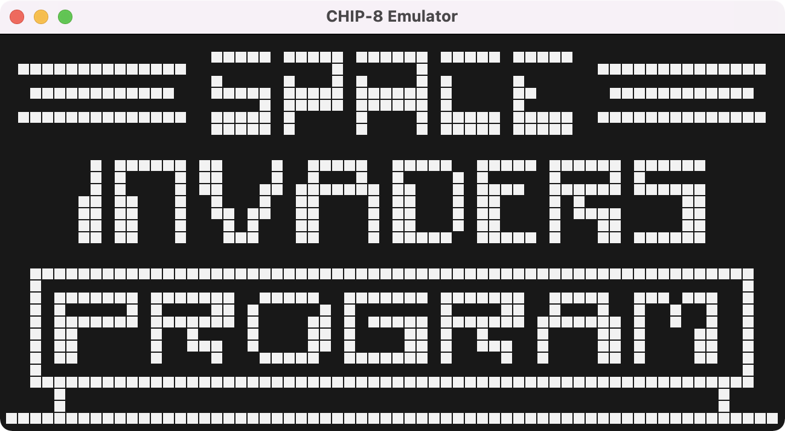
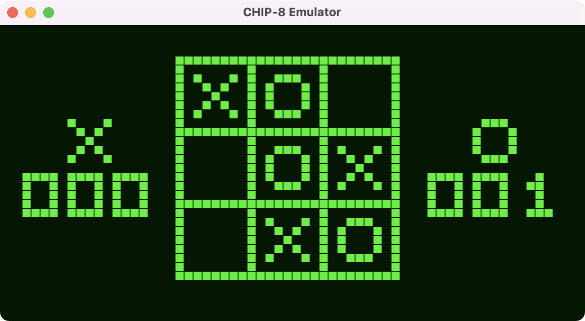
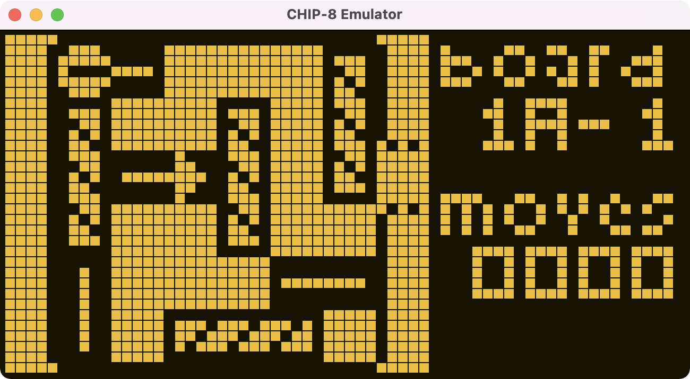

CHIP-8 Emulator in Rust
========================

[](https://github.com/y-taka-23/rust-chip8/actions/workflows/ci.yml)



<div>
  
  
  
</div>

<br>

A CHIP-8 emulator written in Rust and [iced](https://github.com/iced-rs/iced)-powered GUI.

* All 34 CHIP-8 instructions (SUPER CHIP-8 instructions are not supported)
* Sound support by sinusoidal wave beep
* 500 Hz clock speed
* 3 colors of the good-old-time CRT display


How To Run
------------------------

ROM files are not included in the repository. You can download them from e.g.:

* [Chip-8 Games Pack - Chip-8 ROM - Zophar's Domain](https://www.zophar.net/pdroms/chip8/chip-8-games-pack.html)

Remark that, in the game pack, BLITZ and VBRIX don't work correctly. It's not from the emulator's mulfunction, but from implementation bugs in ROMs.

```console
$ git clone https://github.com/y-taka-23/rust-chip8.git
$ cd rust-chip8
$ cargo run -- path/to/ROM_FILE
```

You also can pass the options like `cargo run -- path/to/ROM_FILE --clock 250`.

```
chip8 0.1.0

USAGE:
    chip8 [OPTIONS] <FILE>

ARGS:
    <FILE>    File of the CHIP-8 ROM

OPTIONS:
        --clock <INT>...       Change the clock speed (1-500 Hz) [default: 500]
        --color <STRING>...    Select the display color (white/green/amber) [default: white]
    -h, --help                 Print help information
    -V, --version              Print version information
        --verbose              Show the detailed execution trace

```

Reference
------------------------

* [Cowgod's Chip-8 Technical Reference](http://devernay.free.fr/hacks/chip8/C8TECH10.HTM)
* [Chip-8 Games Pack - Chip-8 ROM - Zophar's Domain](https://www.zophar.net/pdroms/chip8/chip-8-games-pack.html)
